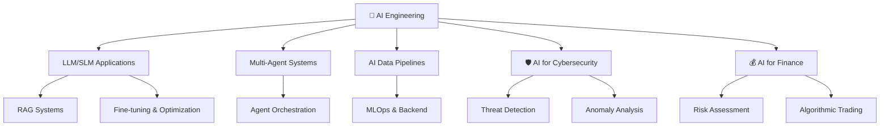

# 👋 Hello! I'm Murilo Fray

  
  
  
  
  

---

## 🚀 About Me

🤖 **AI Engineer** & Computer Science Student at IFSP-PEP  
🌎 **Location:** Brazil  
🎂 **Age:** 23 years old  

### 🎯 Areas of Interest
- 🧠 **Large Language Models (LLMs)**
- 📱 **Small Language Models (SLMs)**
- 🔄 **Multi-Agent Systems**
- ⚙️ **Backend** 
- 🛡️ **AI for Cybersecurity**
- 💰 **AI for Financial Applications**
- 🔐 **AI Security & Ethics**

---

## 🛠️ Tech Stack

### 💻 Programming Languages

### 🤖 AI/ML Frameworks & Libraries

### 🚀 Backend Frameworks

### ⚛️ Frontend Technologies

### 🗄️ Databases

### ⚙️ Tools & Infrastructure

---

## 🌍 Languages

  
| Language | Proficiency |
|----------|-------------|
| 🇧🇷 **Portuguese** | Native |
| 🇺🇸 **English** | Basic |

---

## 📊 GitHub Analytics

  

---

## 🎯 Featured AI Projects

---

## 🏆 Current Focus

```mermaid
graph TD
    A[🤖 AI Engineering] --> B[LLM/SLM Applications]
    A --> C[Multi-Agent Systems]
    A --> D[AI Data Pipelines]
    B --> E[RAG Systems]
    B --> F[Fine-tuning & Optimization]
    C --> G[Agent Orchestration]
    D --> I[MLOps & Backend]
    A --> K[🛡️ AI for Cybersecurity]
    A --> L[💰 AI for Finance]
    K --> M[Threat Detection]
    K --> N[Anomaly Analysis]
    L --> O[Risk Assessment]
    L --> P[Algorithmic Trading]
```

---

## 🤝 Let's Connect!

  

